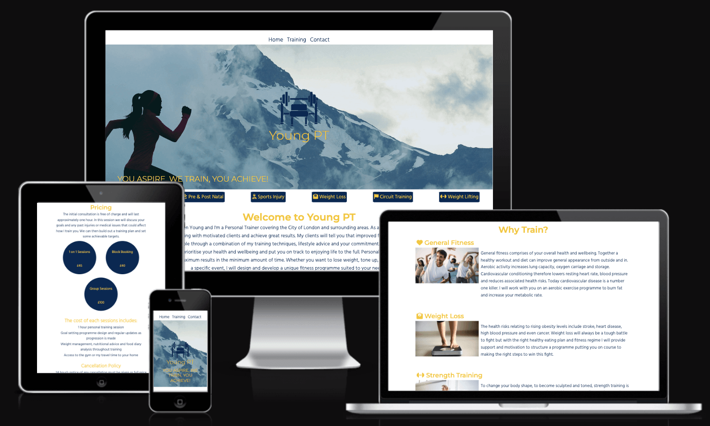
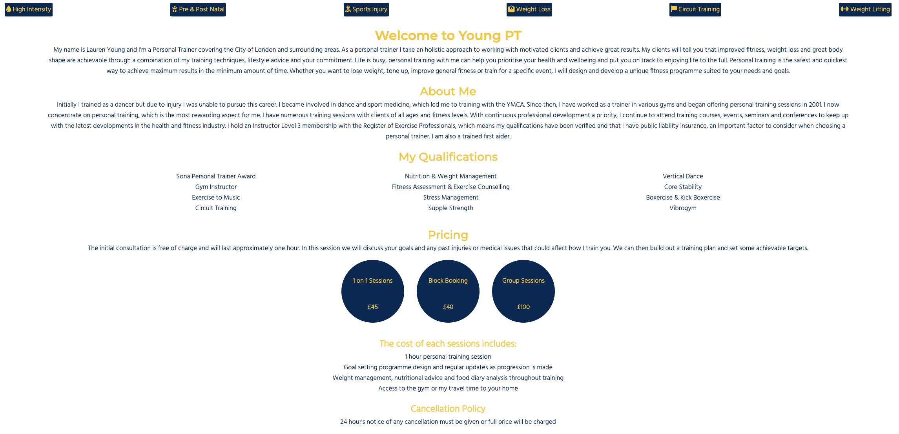
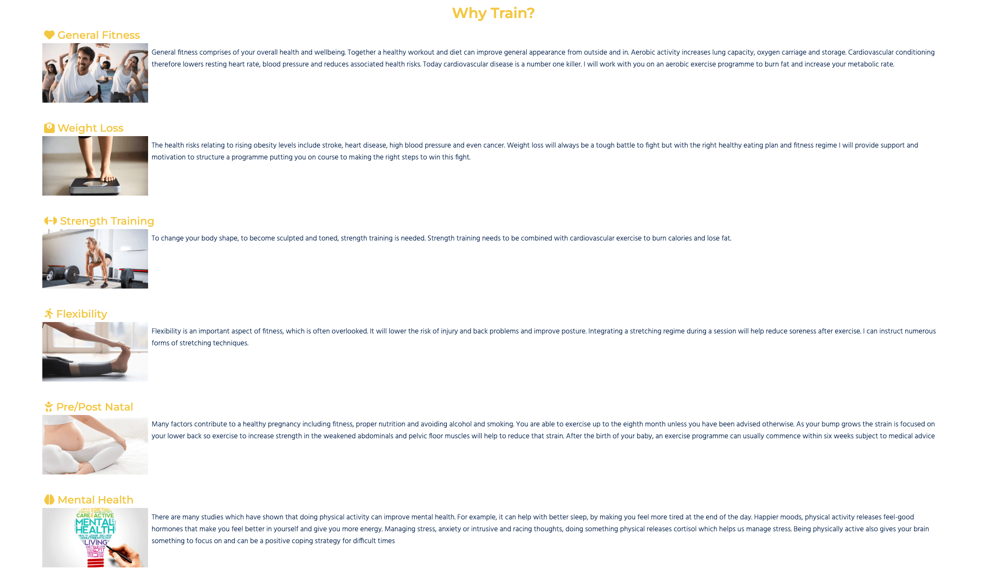
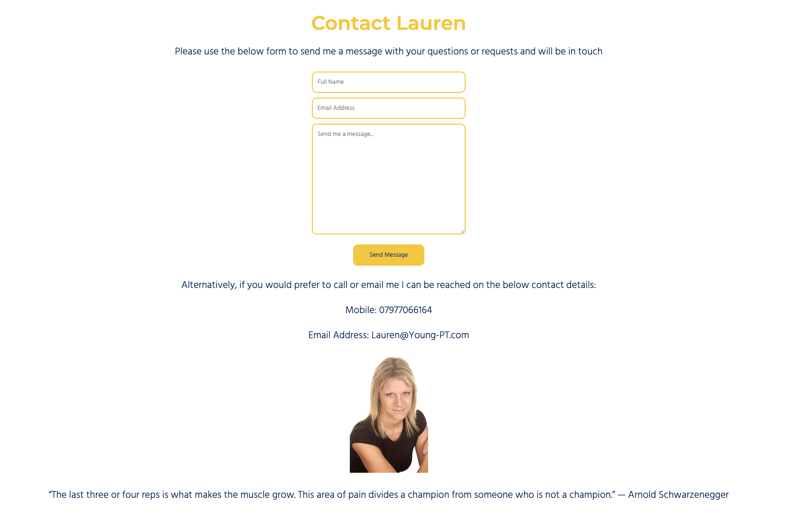
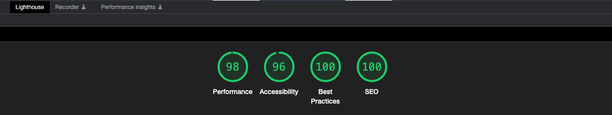

# Young PT

[Live Site](https://adamt84.github.io/YoungPT/)

Welcome to Young PT! This website details the personal training services offered by Lauren Young in the City of London and surrounding areas. This website is aimed anyone in the locale wanting to find out more information on personal training, general fitness or weight loss. 
Young PT will be useful for potential clients to find out more about Lauren, her background and qualifications. Also the types of training available and will include important details such as contact details and training locations. 

## Features

### Existing Features

-  Navigation Bar

    - The Navigation bar is fully responsive and aligned centrally at the top of all pages and includes links to Home, Training and Contact pages. This will ensure the navigation experience is the same across the entire site.
    - The value for the user is a simple navigation method that allows access to any page from any page. 

- Landing page image

    - The landing page image features a photo with the Young PT logo and moto overlayed showing the user that this site relates to training.
    - This will introduce the user to the Young PT brand and colour schemes used through the site. 

- Welcome page

    - The welcome page provides information on Lauren Young, her background, exprience and qualifications. This also includes details of different types of training available.
    - This will provide the user with vital information about Lauren and why they should use her services. It also educates the user on various training types that are on offer, the cost of sessions and cancellation policy.

- Training page

    - The training page provides information on the benefits of pysical training, including information on General Health, Weight Loss, Strength Training, Flexibility, Pre/Post Natal training and Mental health.
    - This will provide education on the benefits of a healthy lifestyle and serve as motivation to get active. 

- Contact page

    - The contact page provides a contact form with fields for name, email and message and lists email and mobile number for Lauren. There is also a picture of Lauren with motivational quote.
    - This will provide the user with multiple options to contact Lauren and also show them what she looks like. 

- Footer

    - The footer contains links to Facebook, Twitter and Instagram and apears on all pages making it easy for users to link to social media. It also includes Lauren's email and phone number on all pages.
    - This will allow the user to visit the young PT social sites from every page and encourage them to connect. It will also allow users imediate access to Lauren's contact page without having to visit a specific page.

### Future Features

- Add animation to the logo on the landing page image to have it move rather just be static.
- Booking form to allow user to book a session not just contact by imbedding a calendar into the site.

# Testing

Continual testing was performed during the development of this site by using DevTools, ensuring that not only did the layout look as intended but also behaved as intended. Once the site had been uploaded to GitHub repository more thorough testing was completed as outlined below.

- The tests were carried out on iOS, MacOS, Windows and Android operating systems
- Devices used in testing were Macbook Pro 16", iMac 27", iPad Pro, iPhone 8 & 12, Lenovo X1 Yoga and Samsung Galaxy S20
- Browsers used in testing: Safari, Chrome (both on Windows and MacOS), Edge and Firefox

## Tests carried out on all pages

- Test pages load correctly across all operating systems and devices
- Test pages are all responsive and clearly viewable on different screen sizes
- Test pages load at an acceptable speed and no images are slow to load
- Test navigation links on all pages work and link to correct pages
- Test social media footer links on all pages to ensure these launch in a new tab and link to correct site

## Additional tests carried out on contact_page.html

- Test to ensure form is clearly readable with placeholder text in each input box
- Test to ensure data is required in all input boxes
- Test to ensure a correctly formatted email address with @ is required in email field
- Test that data in form is sent correctly

## Validator Testing

- HTML

    - All pages had their HTML tested with the official [W3C Validator](https://validator.w3.org/nu/?doc=https%3A%2F%2Fadamt84.github.io%2FYoungPT%2Findex.html) and no errors were returned.

- CSS

    - Stylesheet.css was passed though the official [W3C (Jigsaw) Validator](https://jigsaw.w3.org/css-validator/validator?uri=https%3A%2F%2Fadamt84.github.io%2FYoungPT%2Findex.html&profile=css3svg&usermedium=all&warning=1&vextwarning=&lang=en) and no errors were returned

## DevTools Lighthouse Testing

- Site scores highly in all areas on Lighthouse

## Bugs Encountered

- Hero image formatting on training.html would leave a large gap to the right when viewed on mobile screen size yet the image appeared perfectly on all other screens. Issue was due to adding a margin to content on the page when a margin was already being applied from a parent element, effectively doubling the margin. Once this was removed the image displayed as expected. 

- Contact form not giving a response when submitting data. Issue was cause by an incorrect action URL in the form element.

# Deployment

This site has been deployed to GitHub Pages. The steps needed to deploy are listed below:

- In the GitHub repository select settings
- Once on the settings page select pages from left hand menu
- You will now see "Build and Deployment" options
- Look for the "Branch" heading
- Here you will see a drop down menu with the options none and main
- Select main and then hit save
- Within a few minutes a ribbon will appear detailing that the site is live and the deployment was successful

[Click here to visit live site](https://adamt84.github.io/YoungPT/)

# Credits

## Content

- Text for welcome, about and qualifications was taken from [Young-PT](http://young-pt.com/) and edited by the developer with permission from site owner
- Code for social icons on footer was taken from the Love Running a Code Institute walkthough project
- Input action URL for Contact_Page.html contact form was take from Code Institute
- Icons used on site were from [Font Awesome](https://fontawesome.com/)

## Media

- Photo used for hero image was taken from [Shutterstock](https://www.shutterstock.com/) and edited by the developer 
- Photo used for training.html were taken from [Adobe Express](https://www.adobe.com/express/?sdid=SL4KM9XN&mv=search&ef_id=EAIaIQobChMIktLTurGp_AIV0AGtBh3FAgNLEAAYASAAEgJ6T_D_BwE:G:s&s_kwcid=AL!3085!3!589020195299!p!!g!!express%20adobe!16624093353!135127940375) and edited by the developer
- Photo of Lauren Young on contact page taken from [Young-PT](http://young-pt.com/) and edited by the developer with permission from site owner