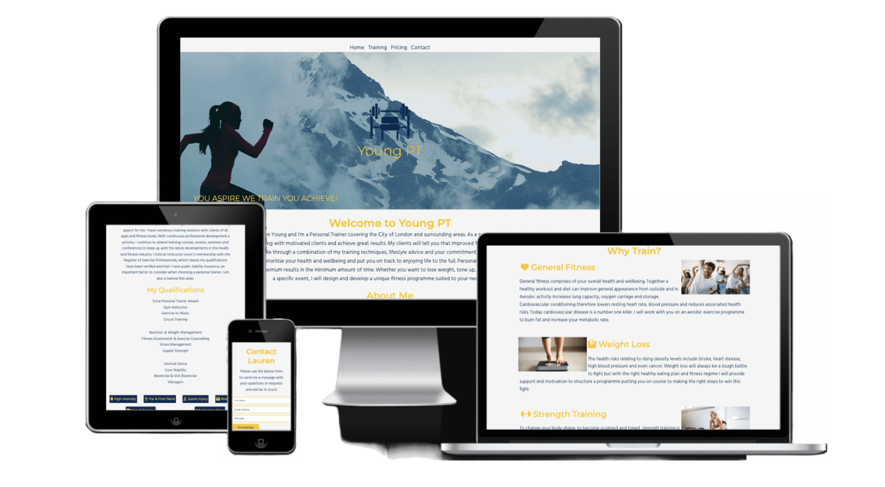
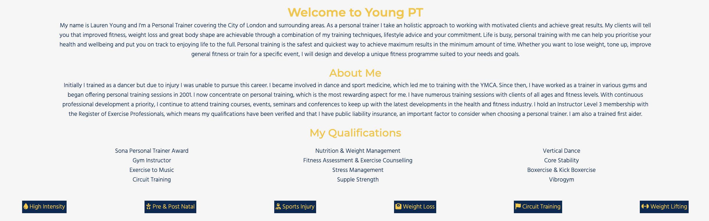
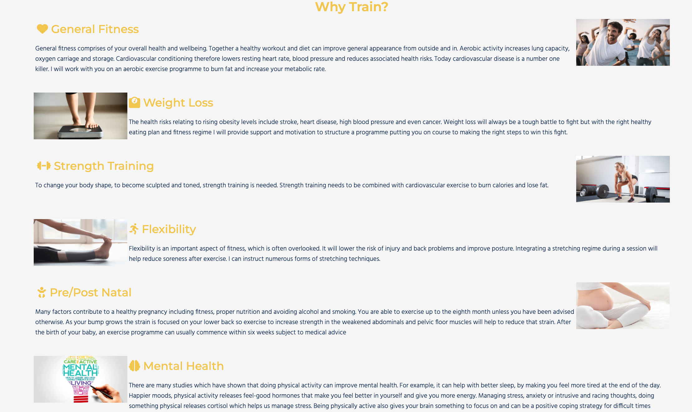
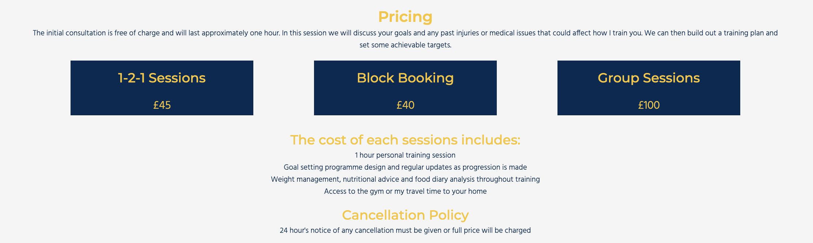
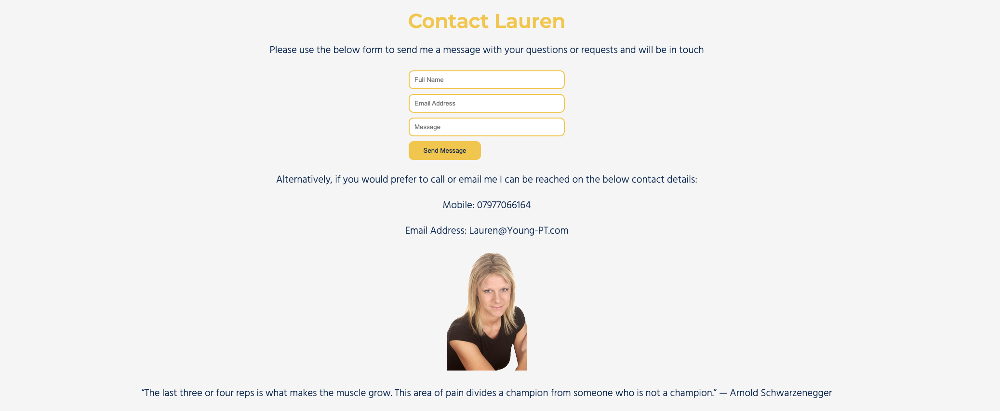

# Young PT

Welcome to Young PT! This website details the personal training services offered by Lauren Young in the City of London and surrounding areas. This website is aimed anyone in the locale wanting to find out more information on personal training, general fitness or weight loss. 
Young PT will be useful for potential clients to find out more about Lauren, her background and qualifications. Also the types of training available and will include important details such as contact details and training locations. 

## Features

### Existing Features

-  Navigation Bar

    - The Navigation bar is fully responsive and aligned centrally at the top of all pages and includes links to Home, Training, Pricing and Contact pages. This will ensure the navigation experience is the same across the entire site.
    - The value for the user is a simple navigation method that allows access to any page from any page. 

- Landing page image

    - The landing page image features a photo with the Young PT logo and moto overlayed showing the user that this site relates to training.
    - This will introduce the user to the Young PT brand and colour schemes used through the site. 

- Welcome page

    - The welcome page provides information on Lauren Young, her background, exprience and qualifications. This also includes details of different types of training available.
    - This will provide the user with vital information about Lauren and why they should use her services. It also educates the user on various training types that are on offer.

- Training page

    - The training page provides information on the benefits of pysical training, including information on General Health, Weight Loss, Strength Training, Flexibility, Pre/Post Natal training and Mental health.
    - This will provide education on the benefits of a healthy lifestyle and serve as motivation to get active. 

- Pricing page

    - The pricing page details the cost of 1-2-1 sessions, block booking and group sessions. It also details what is included in each session and shows the cancellation policy.
    - User will imediately be able to see the cost of sessions, what they can expect from each session and what they need to do should they wish to cancel a booked session.

- Contact page

    - The contact page provides a contact form with fields for name, email and message and lists email and mobile number for Lauren. There is also a picture of Lauren with motivational quote.
    - This will provide the user with multiple options to contact Lauren and also show them what she looks like. 

- Footer

    - The footer contains links to Facebook, Twitter and Instagram and apears on all pages making it easy for users to link to social media.
    - This will allow the user to visit the young PT social sites from every page and encourage them to connect.

## Future Features

- Add animation to the logo on the landing page image to have it move rather just be static.
- Booking form to allow user to book a session not just contact.

# Testing

